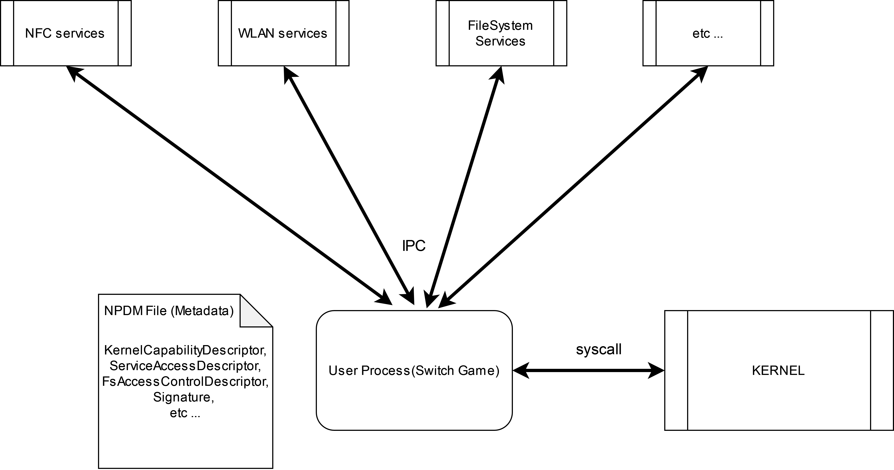
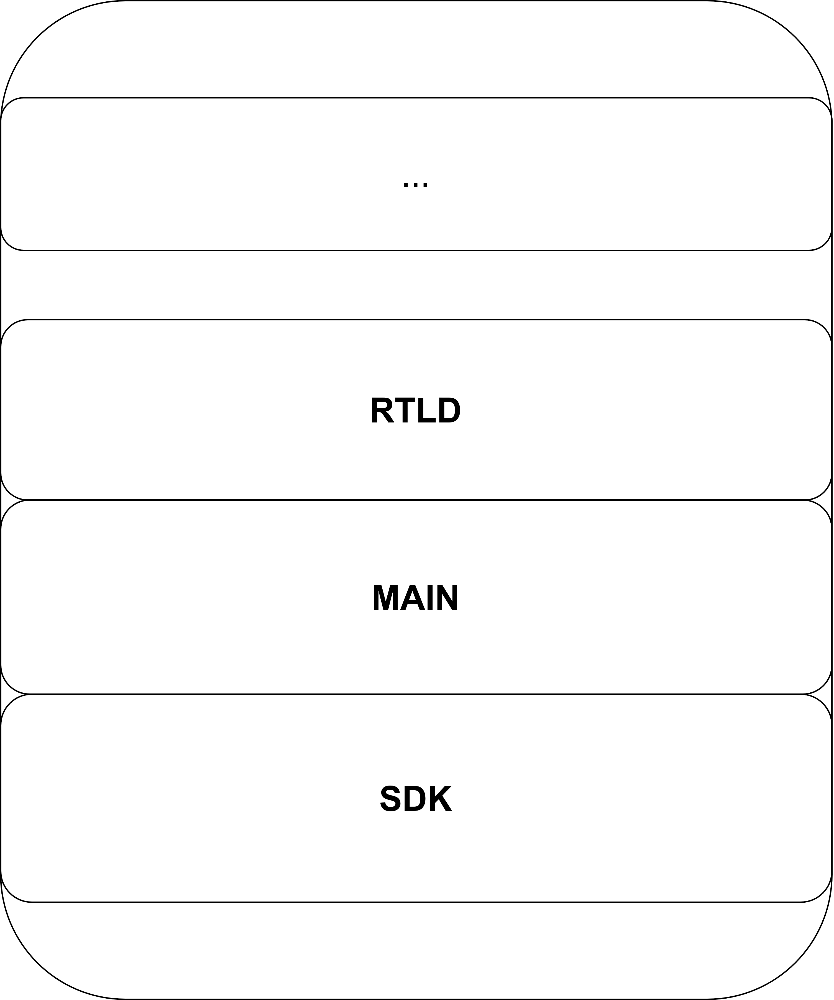

# Nintendo Switch 구조
## 개요
Splatoon2, Super Mario Maker2를 보면서 공통적인 특성을 갖고 있는 것을 발견했다.
분석에 참고될만해보여서 글로 작성한다.
## 구조
### 다이어그램



### 프로세스 메모리 구조



### 설명 
스위치의 게임들은 기본적으로 세가지가 함께 올라간다.
Rtld, Main, SDK. 
SDK는 shared library같은 역할을 수행한다.
Rtld는 게임이 로드되고 제일 먼저 실행되며 초기화를 진행한다.
Sdk의 대부분의 함수들은 심볼이 있다.

### RTLD
dlsym과 유사한 함수가 존재한다.
가장 흔한 패턴은 Sdk에서 함수가 동작하면서 Rtld 영역의 있는 dlsym같은 함수를 이용하여 symbol resolve이후 sdk의 함수를 호출하는 경우다.
Sdk가 어떤 함수를 호출하면 rtld로 심볼 resolve해서 got을 수정한다
실제 초기에 호출할 때 그 함수 포인터에는 rtld의 symbol resolve 함수의 주소가 적혀있다. 
symbol resolve된 주소가 테이블에 쓰여지며 동작한다.
```
__int64 sub_83386660()
{
  return qword_83A787A0();
}
```
```
.text_rtld0:0000000080001624 LDR             X17, [SP,#arg_0]
.text_rtld0:0000000080001628 STR             X29, [SP,#arg_0]
.text_rtld0:000000008000162C STP             X8, X19, [SP,#var_10]!
.text_rtld0:0000000080001630 STP             X6, X7, [SP,#0x10+var_20]!
.text_rtld0:0000000080001634 STP             X4, X5, [SP,#0x20+var_30]!
.text_rtld0:0000000080001638 STP             X2, X3, [SP,#0x30+var_40]!
.text_rtld0:000000008000163C STP             X0, X1, [SP,#0x40+var_50]!
.text_rtld0:0000000080001640 STP             Q6, Q7, [SP,#0x50+var_70]!
.text_rtld0:0000000080001644 STP             Q4, Q5, [SP,#0x70+var_90]!
.text_rtld0:0000000080001648 STP             Q2, Q3, [SP,#0x90+var_B0]!
.text_rtld0:000000008000164C STP             Q0, Q1, [SP,#0xB0+var_D0]!
.text_rtld0:0000000080001650 MOV             X29, SP
.text_rtld0:0000000080001654 MOV             X19, X17
.text_rtld0:0000000080001658 SUB             X1, X17, X16
.text_rtld0:000000008000165C SUB             X1, X1, #8
.text_rtld0:0000000080001660 LSR             X1, X1, #3
.text_rtld0:0000000080001664 LDUR            X0, [X16,#-8]
.text_rtld0:0000000080001668 BL              unk_80000800
.text_rtld0:000000008000166C STR             X0, [X19]
.text_rtld0:0000000080001670 MOV             X16, X0
.text_rtld0:0000000080001674 LDP             Q0, Q1, [SP+0xD0+var_D0],#0x20
.text_rtld0:0000000080001678 LDP             Q2, Q3, [SP+0xB0+var_B0],#0x20
.text_rtld0:000000008000167C LDP             Q4, Q5, [SP+0x90+var_90],#0x20
.text_rtld0:0000000080001680 LDP             Q6, Q7, [SP+0x70+var_70],#0x20
.text_rtld0:0000000080001684 LDP             X0, X1, [SP+0x50+var_50],#0x10
.text_rtld0:0000000080001688 LDP             X2, X3, [SP+0x40+var_40],#0x10
.text_rtld0:000000008000168C LDP             X4, X5, [SP+0x30+var_30],#0x10
.text_rtld0:0000000080001690 LDP             X6, X7, [SP+0x20+var_20],#0x10
.text_rtld0:0000000080001694 LDP             X8, X19, [SP+0x10+var_10],#0x10
.text_rtld0:0000000080001698 LDP             X29, X30, [SP+arg_0],#0x10
.text_rtld0:000000008000169C BR              X16
.text_rtld0:000000008000169C ; End of function sub_80001624
.text_rtld0:000000008000169C
.text_rtld0:000000008000169C ; ----------
```
Code로 인식시키고 함수로 만들어주면 아래와 같은 결과를 확인할 수 있다.
```
// positive sp value has been detected, the output may be wrong!
__int64 __fastcall sub_80001624(
        __int64 a1,
        __int64 a2,
        __int64 a3,
        __int64 a4,
        __int64 a5,
        __int64 a6,
        __int64 a7,
        __int64 a8)
{
  __int64 v8; // x16
  __int64 (__fastcall *v9)(__int64, __int64, __int64, __int64, __int64, __int64, __int64, __int64); // x0
  __int64 (__fastcall **v19)(__int64, __int64, __int64, __int64, __int64, __int64, __int64, __int64); // [xsp+C0h] [xbp-10h]

  v9 = (__int64 (__fastcall *)(__int64, __int64, __int64, __int64, __int64, __int64, __int64, __int64))((__int64 (__fastcall *)(_QWORD, unsigned __int64))unk_80000800)(*(_QWORD *)(v8 - 8), ((unsigned __int64)v19 - v8 - 8) >> 3);
  *v19 = v9;
  return v9(a1, a2, a3, a4, a5, a6, a7, a8);
}
```
위와 같은 패턴이 사용되면서 symbol을 통해 특정 함수를 찾는다.
```
_int64 v20; // [xsp+4h] [xbp-6Ch]
  __int64 v21; // [xsp+Ch] [xbp-64h]
  int v22; // [xsp+14h] [xbp-5Ch]
  int v23; // [xsp+18h] [xbp-58h] BYREF
  __int64 v24; // [xsp+1Ch] [xbp-54h]
  __int64 v25; // [xsp+24h] [xbp-4Ch]
  int v26; // [xsp+2Ch] [xbp-44h]
  __int64 v27; // [xsp+30h] [xbp-40h]
  __int64 v28; // [xsp+38h] [xbp-38h]
  int v29; // [xsp+40h] [xbp-30h]
  __int64 v30; // [xsp+48h] [xbp-28h] BYREF

  if ( !*(_BYTE *)(a1 + 48) )
  {
    v10 = (unsigned int *)(*(_QWORD *)(a1 + 104) + 24LL * *(unsigned int *)(*(_QWORD *)(a1 + 16) + 16LL * a2 + 12));
    v11 = *(_QWORD *)(v10 + 3);
    v12 = v10[5];
    v13 = *v10;
    v27 = *(_QWORD *)(v10 + 1);
    v28 = v11;
    v22 = v12;
    v29 = v12;
    v19 = v13;
    v21 = v11;
    v20 = v27;
    if ( (sub_80000E30(a1, &v30, &v19) & 1) != 0 )
      return v30;
    v16 = ((__int64 (__fastcall *)(const char *))unk_80001948)("[rtld] Unresolved symbol: '");
    ((void (__fastcall *)(const char *, __int64))unk_80001704)("[rtld] Unresolved symbol: '", v16);
    v15 = *(_QWORD *)(a1 + 96) + v13;
    goto LABEL_9;
  }
  v4 = *(_QWORD *)(a1 + 16);
  v5 = (unsigned int *)(*(_QWORD *)(a1 + 104) + 24LL * *(unsigned int *)(v4 + 24LL * a2 + 12));
  v6 = *(_QWORD *)(v5 + 3);
  v7 = v5[5];
  v8 = *v5;
  v27 = *(_QWORD *)(v5 + 1);
  v28 = v6;
  v26 = v7;
  v29 = v7;
  v23 = v8;
  v25 = v6;
  v24 = v27;
  if ( (sub_80000E30(a1, &v30, &v23) & 1) == 0 )
  {
    v14 = ((__int64 (__fastcall *)(const char *))unk_80001948)("[rtld] Unresolved symbol: '");
    ((void (__fastcall *)(const char *, __int64))unk_80001704)("[rtld] Unresolved symbol: '", v14);
    v15 = *(_QWORD *)(a1 + 96) + v8;
LABEL_9:
    v17 = ((__int64 (__fastcall *)(__int64))unk_80001948)(v15);
    ((void (__fastcall *)(__int64, __int64))unk_80001704)(v15, v17);
    v18 = ((__int64 (__fastcall *)(void *))unk_80001948)(&unk_800027FB);
    ((void (__fastcall *)(void *, __int64))unk_80001704)(&unk_800027FB, v18);
    result = 0LL;
    v30 = 0LL;
    return result;
  }
  if ( !v30 )
    return 0LL;
  result = *(_QWORD *)(v4 + 24LL * a2 + 16) + v30;
  v30 = result;
  return result;
}
```
Symbol resolve를 한다.


switch mapper.py를 이용해서 쉽게 구분할 수 있다.
```
.data:0000000083A80208 off_83A80208 DCQ sub_83386660           ; DATA XREF: nn::image::detail::ReadJpegHeader(nn::image::detail::JpegInfo *,uchar const*,ulong,uint)↑o
.data:0000000083A80208                                         ; nn::image::detail::ReadJpegHeader(nn::image::detail::JpegInfo *,uchar const*,ulong,uint)+4↑r ...
.data:0000000083A80210 off_83A80210 DCQ sub_83386660           ; DATA XREF: nn::image::detail::SetJpegHeader(nn::image::detail::JpegInfo *,ushort,ushort,nn::image::JpegSamplingRatio)↑o
.data:0000000083A80210                                         ; nn::image::detail::SetJpegHeader(nn::image::detail::JpegInfo *,ushort,ushort,nn::image::JpegSamplingRatio)+4↑r ...
.data:0000000083A80218 ; __int64 (*off_83A80218)(void)
.data:0000000083A80218 off_83A80218 DCQ _ZN2nn5image6detail17ExtractJpegHeaderEPNS1_10JpegHeaderEPKvmi
.data:0000000083A80218                                         ; DATA XREF: nn::image::detail::ExtractJpegHeader(nn::image::detail::JpegHeader *,void const*,ulong,int)↑o
.data:0000000083A80218                                         ; nn::image::detail::ExtractJpegHeader(nn::image::detail::JpegHeader *,void const*,ulong,int)+4↑r ...
.data:0000000083A80220 off_83A80220 DCQ sub_83386660           ; DATA XREF: nn::image::detail::jpeg::jpeg_std_error(nn::image::detail::jpeg::jpeg_error_mgr *)↑o
.data:0000000083A80220                                         ; nn::image::detail::jpeg::jpeg_std_error(nn::image::detail::jpeg::jpeg_error_mgr *)+4↑r ...
.data:0000000083A80228 ; __int64 (*off_83A80228)(void)
.data:0000000083A80228 off_83A80228 DCQ sub_83386660           ; DATA XREF: nn::image::detail::jpeg::jpeg_CreateDecompress(nn::image::detail::jpeg::jpeg_decompress_struct *,int,ulong)↑o
.data:0000000083A80228                                         ; nn::image::detail::jpeg::jpeg_CreateDecompress(nn::image::detail::jpeg::jpeg_decompress_struct *,int,ulong)+4↑r ...
.data:0000000083A80230 off_83A80230 DCQ sub_83386660           ; DATA XREF: nn::image::detail::jpeg::jpeg_mem_src(nn::image::detail::jpeg::jpeg_decompress_struct *,uchar *,ulong)↑o
.data:0000000083A80230                                         ; nn::image::detail::jpeg::jpeg_mem_src(nn::image::detail::jpeg::jpeg_decompress_struct *,uchar *,ulong)+4↑r ...
.data:0000000083A80238 ; __int64 (*off_83A80238)(void)
.data:0000000083A80238 off_83A80238 DCQ sub_83386660           ; DATA XREF: nn::image::detail::jpeg::jpeg_read_header(nn::image::detail::jpeg::jpeg_decompress_struct *,bool)↑o
.data:0000000083A80238                                         ; nn::image::detail::jpeg::jpeg_read_header(nn::image::detail::jpeg::jpeg_decompress_struct *,bool)+4↑r ...
.data:0000000083A80240 ; __int64 (*off_83A80240)(void)
.data:0000000083A80240 off_83A80240 DCQ sub_83386660           ; DATA XREF: nn::image::detail::jpeg::jpeg_start_decompress(nn::image::detail::jpeg::jpeg_decompress_struct *)↑o
.data:0000000083A80240                                         ; nn::image::detail::jpeg::jpeg_start_decompress(nn::image::detail::jpeg::jpeg_decompress_struct *)+4↑r ...
.data:0000000083A80248 off_83A80248 DCQ sub_83386660           ; DATA XREF: nn::image::detail::jpeg::jpeg_read_scanlines(nn::image::detail::jpeg::jpeg_decompress_struct *,uchar **,int)↑o
.data:0000000083A80248                                         ; nn::image::detail::jpeg::jpeg_read_scanlines(nn::image::detail::jpeg::jpeg_decompress_struct *,uchar **,int)+4↑r ...
.data:0000000083A80250 off_83A80250 DCQ sub_83386660
```
Symbol resolve 이후 위와 같이 Got가 수정된다.
### SDK
Lazy binding을 사용한다.
쓰레드를 생성하는 함수들도 여기에 있다.
특이한점은 linux libc의 구현도 일부 존재한다는 점이다.
memcpy, strcmp, puts, strlen 등이 있다.

### Main 
기본적으로 쓰레드들은 서로 상호작용을 Message queue를 통해 진행한다.
특정 작업을 전담하는 쓰레드들이 항상 존재한다.

## 시스템 서비스
여러 서비스들이 존재한다.
직접 svc를 통한 시스콜을 통해 직접 유저 프로세스가 자원을 접근하는 방식이 아니고, sysmoudules들을 통해 대리로 처리한다. 
SDK에 API가 존재한다.
이 API는 특정 시스콜을 통해 시스템 서비스의 핸들을 가져오고, 그 서비스의 메모리가 shared로 매핑된다. IPC를 통해 작업을 처리하기 때문에 유저레벨 프로세스에서 직접 리소스에 접근하여 소켓 연결등을 할 수 없다.
### 예시
svc 0x21 SendSyncRequest로 IPC요청을 보낸다.
실제 패킷을 보내는 부분도 0x21로 IPC로 요청을 보낸다. 
r— 권한으로 shared메모리가 매핑되어있다.
결과가 그 readonly shared memory에 들어온다.
### 시스템콜
System service는 일반 유저와는 시스템 콜을 이용한다.
IPC 매핑이나 Accept session 등 여러 시스템 콜을 이용한다.
일반적으로 그런 시스템콜들은 게임에서 허용되어있지 않으며, 게임에서 그 시스템 콜 호출이 막혀있다.
## 샌드박스
npdm 파일에는 그 파일에 대한 권한이 정의되어있다.


만약 샌드박스상으로 막힌 시스템 콜을 사용한다면, 패닉이 일어난다.
SDK 래퍼상으로는 시스콜 호출 코드가 있는 경우가 있었는데, 실제로는 호출이 안되는 것으로 파악된다.

